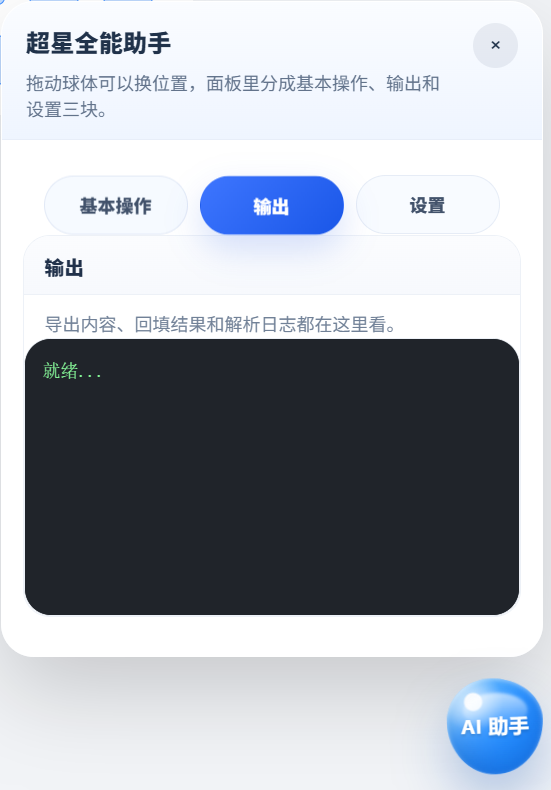
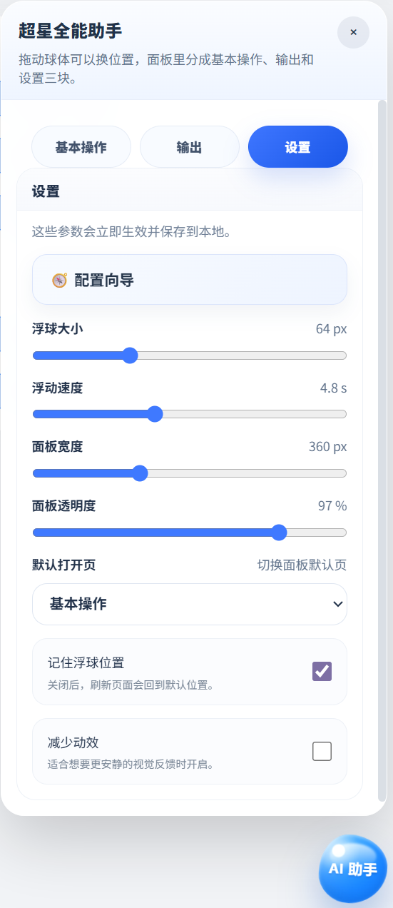

# 超星作业 AI 助手


用于超星学习通作业页面的用户脚本，提供题目导出、AI 回填、UEditor 粘贴解锁、拖动浮球入口和可配置面板。

## 项目地址

- GitHub 源码：<https://github.com/TextlineX/chaoxing-ai-assistant>
- GreasyFork：<https://greasyfork.org/zh-CN/scripts/577882-%E8%B6%85%E6%98%9F%E4%BD%9C%E4%B8%9A-ai-%E5%8A%A9%E6%89%8B>
- ScriptCat：<https://scriptcat.org/zh-CN/script-show-page/6252>

## 脚本信息

- 脚本名称：`超星作业 AI 助手`
- 作者：`Textline`
- 当前版本：`24.5`
- 许可证：`MIT`
- 运行环境：`Tampermonkey` / `ScriptCat` / 其他兼容用户脚本管理器
- 适用平台：`超星学习通`

## 截图

下面 3 张截图统一使用相同展示框，便于 README 视觉保持一致。

<table>
  <tr>
    <td align="center">
      
      <br />
      <sub>基本操作</sub>
    </td>
    <td align="center">
      
      <br />
      <sub>输出</sub>
    </td>
    <td align="center">
      
      <br />
      <sub>设置</sub>
    </td>
  </tr>
</table>

## 特性

- 自动解除超星编辑器的 `beforepaste` 粘贴限制
- 左下角浮球入口支持拖动，并会记住位置
- 浮球带有液态呼吸感和流动动画
- 面板支持开合动画，并拆成 `基本操作 / 输出 / 设置` 三个板块
- 设置区可调整浮球大小、浮动速度、面板宽度、透明度、默认打开页、记住位置、减少动效
- 首次使用会弹出独立的 `配置向导`，也可以从设置里再次打开
- 支持导出题目提示词、读取 AI 返回 JSON 并回填
- 支持在输出区显示 `analysis` 解析内容
- 兼容单选、多选、填空等常见题型

## 适用页面

- `https://mooc1.chaoxing.com/mooc-ans/mooc2/work/view*`
- `https://mooc1.chaoxing.com/mooc-ans/mooc2/work/dowork*`

当前脚本头部显式匹配作业查看页和答题页。如果超星后续调整页面地址或 DOM 结构，需要同步更新 `@match` 和选择器。

## 安装

1. 安装浏览器扩展
   - Tampermonkey
   - 或其他兼容的用户脚本管理器
2. 打开脚本文件 `超星作业 助手.user.js`
3. 通过脚本管理器导入并启用
4. 刷新超星作业页面

## 使用流程

### 1. 打开面板

点击页面左下角的 `AI 助手` 浮球。

### 2. 导出题目

在 `基本操作` 中点击：

- `导出题目`

脚本会抓取页面内 `.questionLi` 题目节点，读取标题和选项，拼成提示词并复制到剪贴板。

导出结果要求 AI 返回 JSON 数组，并且每条数据至少包含：

- `questionId`
- `answer`
- `analysis`

### 3. 回填答案

把 AI 返回结果复制到剪贴板，然后点击：

- `一键回填`

脚本会截取剪贴板中第一个 `[` 到最后一个 `]` 之间的内容，并尝试解析为 JSON 数组。

回填规则：

- 填空题：按 `;`、`；` 或换行拆分
- 选择题：根据答案字母匹配页面选项
- 多选题：优先调用页面暴露的 `addMultipleChoice`
- 单选题：优先调用页面暴露的 `addChoice`
- 其他情况：回退为直接点击对应选项

### 4. 查看输出

切到 `输出` 分区，可以查看：

- 导出是否成功
- 回填过程
- `analysis` 解析日志

### 5. 调整设置

切到 `设置` 分区，可以配置：

- 浮球大小
- 浮动速度
- 面板宽度
- 面板透明度
- 默认打开页
- 是否记住浮球位置
- 是否减少动效

`配置向导` 也在这里，适合第一次使用时快速了解各个板块。

## 返回格式示例

```json
[
  {
    "questionId": "123456",
    "answer": "A",
    "analysis": "根据题干关键词可知选 A"
  },
  {
    "questionId": "123457",
    "answer": "AB",
    "analysis": "两个选项都满足条件"
  },
  {
    "questionId": "123458",
    "answer": "第一空；第二空",
    "analysis": "填空题按分号拆分"
  }
]
```

## 页面依赖

脚本当前依赖以下页面结构或全局对象：

- 题目容器：`.questionLi`
- 题目标题：`h3`
- 选项节点：`.answerBg`
- 兼容选项：`.answer_item`、`.options li`
- 填空编辑器：`UE.getEditor(...)`

如果超星页面结构变化，这些选择器可能需要同步更新。

## 注意事项

- 需要浏览器允许脚本读取剪贴板
- 回填前请确认剪贴板内容是合法 JSON 或包含合法 JSON 的文本
- 该脚本依赖当前页面 DOM，不保证适配所有超星旧版/新版页面
- 请遵守学校和平台的使用规范

## 版本

- 当前脚本版本：`24.5`

## 许可证

- `MIT`

## 文件

- `超星作业 助手.user.js`：主脚本
- `README.md`：项目说明

## 后续建议

如果你要把这个项目做得更像成熟开源项目，我建议下一步补这几项：

1. `CHANGELOG.md`
2. `CONTRIBUTING.md`
3. `LICENSE` 文件本体
4. 版本发布记录和更新历史
